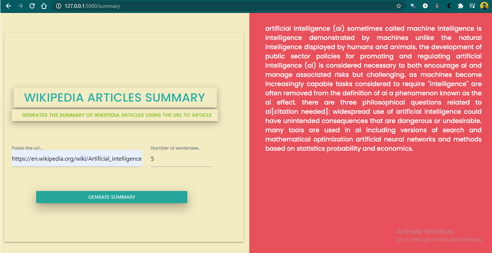

<br />
<p align="center">
  <a href="https://github.com/github_Abhayparashar/Wikipedia-article-summrization">
    
  </a>

  <h3 align="center">Wikipedia-article-summrization</h3>

  <p align="center">
      This flask app  performs the task of summarizing the articles from wikipedia ...
    <br />
    <a href="https://github.com/Abhayparashar31/Wikipedia-article-summrization/"><strong>Explore the Project »</strong></a>
    <br />
    <br />
    <a href="#">View Web Demo</a>
    ·
    <a>Report Bug -> parasharabhay13@gmail.com</a>
    
  </p>
</p>


<!-- TABLE OF CONTENTS -->
## Table of Contents

* [Project](#project)
  * [Built With](#built-with)
* [Getting Started](#getting-started)
  * [Prerequisites](#prerequisites)
  * [Installation](#installation)
* [Contributers](#contributers)
* [License](#license)
* [Contact](#contact)


<!-- ABOUT THE PROJECT -->
## Project

 <a href="https://github.com/github_Abhayparashar/Wikipedia-article-summrization">
    
  </a>

`Abhayparashar31`, `Wikipedia-article-summrization`,  `parasharabhay13@gmail.com`


### Built With

* python
* Natural language processing


<!-- GETTING STARTED -->
## Getting Started

Clone the repo and extract it ....

### Prerequisites

This is the list of things you need to use the software and how to install them.
* Python
```sh
Version python3.7<
```

### Installation
 
1. Clone the repo
```
git clone https://github.com/github_Abhayparashar31/Google-Search-Query-Assistant.git
```
2. Install Python Libraries
```
pip install requests
pip install BeautifulSoup
pip install nltk
pip install google

```

3. Required Imports:
```
from bs4 import BeautifulSoup 
import requests
from googlesearch import search
import re
from nltk.tokenize import sent_tokenize,word_tokenize
import heapq
from nltk.corpus import stopwords
  ```
## Contributers

Abhayparashar31


<!-- LICENSE -->
## License

Distributed under the MIT License. See `LICENSE` for more information.


<!-- CONTACT -->
## Contact

Your Name - Abhayparashar31

Project Link: [https://github.com/Abhayparashar31/Wikipedia-article-summrization/](https://github.com/Abhayparashar31/Wikipedia-article-summrization/)


## References
* Stackoverflow
* Data flair
* Towards data science
